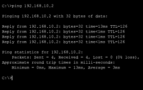
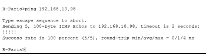
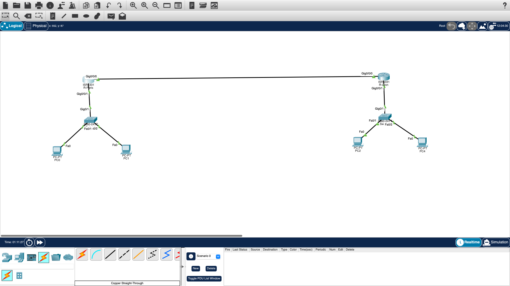

# 🌐 Projet CCNA : Infrastructure Réseau Multi-Sites (Paris & Lyon)

## 📌 Présentation du Projet
Ce projet simule l'interconnexion de deux agences régionales via un lien WAN. L'objectif est de garantir une communication fluide et sécurisée entre les hôtes de chaque site tout en optimisant l'espace d'adressage IP.

## 🧠 Le concept clé : Le VLSM (Variable Length Subnet Mask)
**Définition simple :** Le VLSM est une technique qui permet de découper un réseau principal en plusieurs sous-réseaux de tailles différentes. Contrairement au découpage classique (FLSM), il permet d'adapter précisément le nombre d'adresses IP aux besoins réels de chaque site (50 pour Paris, 20 pour Lyon, 2 pour le WAN). Cela évite le gaspillage d'adresses et optimise la gestion du masque de sous-réseau pour chaque segment.

## 🛠️ Architecture Technique
* **Routeurs :** 2x Cisco 4331 (R-Paris & R-Lyon)
* **Switches :** 2x Cisco 2960
* **Adressage :** Base 192.168.10.0/24 segmentée en VLSM

### 📋 Plan d'Adressage Opti-Réseau
| Sous-réseau | Besoin Hôtes | CIDR | Masque | Passerelle (GW) |
| :--- | :--- | :--- | :--- | :--- |
| **LAN Paris** | 50 | /26 | 255.255.255.192 | 192.168.10.1 |
| **LAN Lyon** | 20 | /27 | 255.255.255.224 | 192.168.10.65 |
| **Lien WAN** | 2 | /30 | 255.255.255.252 | N/A |

---

## ✅ Preuves de Fonctionnement (Captures d'écran)

### 1. Communication Inter-sites (PC Lyon -> PC Paris)
Validation finale de la connectivité de bout en bout avec 0% de perte.

### 2. Validation du Lien WAN (Liaison Routeur à Routeur)
Succès du ping entre les interfaces série/gigabit des deux routeurs (!!!!!).

### 3. Schéma de la Topologie
Vue d'ensemble de l'infrastructure configurée sous Cisco Packet Tracer.

---
*Projet réalisé en 2026 - Portfolio Cybersécurité & Networking*
